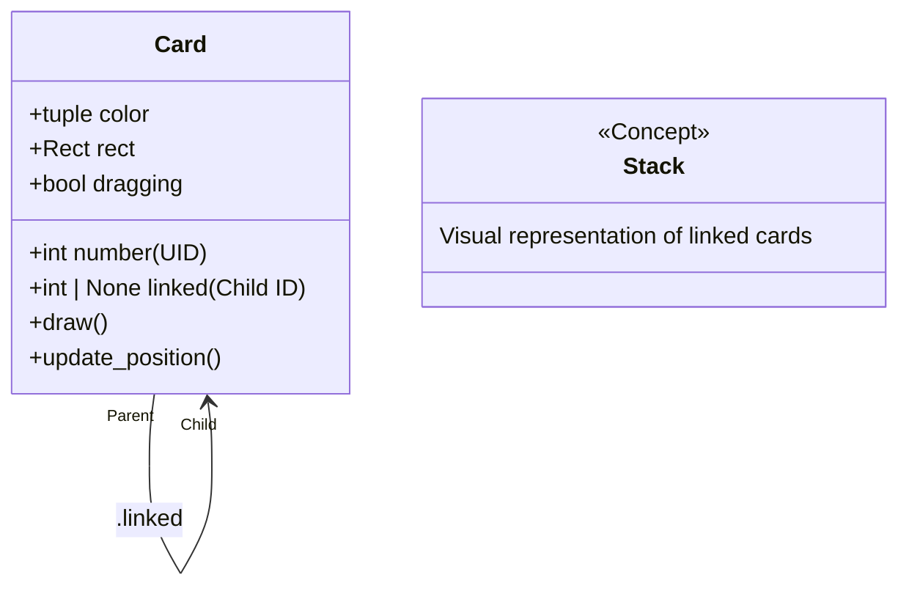
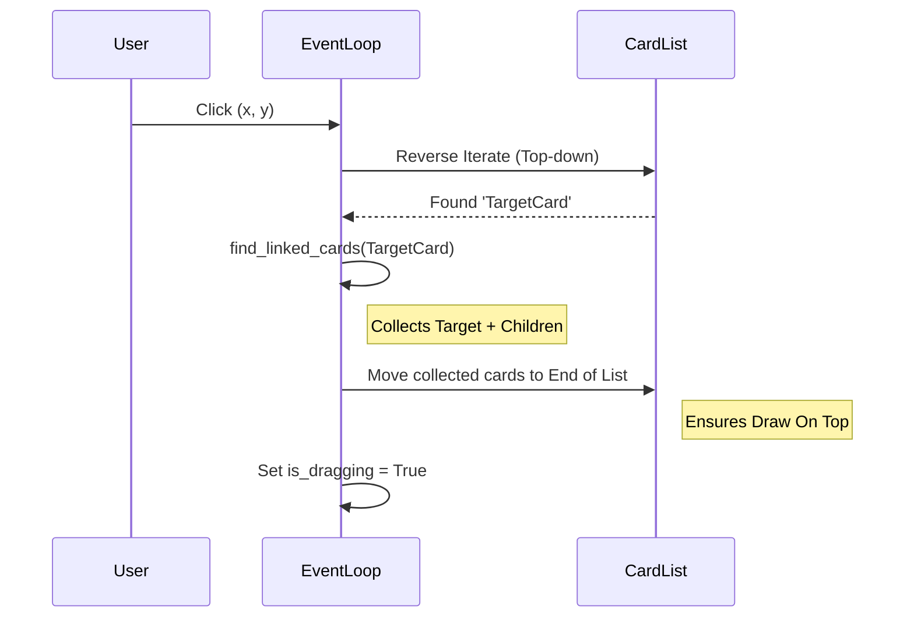

# System Architecture

## 1. High-Level Overview
The application is a standalone Python executable built on the `pygame` library. It simulates a physical tabletop environment where cards can be manipulated individually or in linked stacks. The system operates on an **Immediate Mode** paradigm where the game loop continuously processes inputs, updates world state, and re-renders the entire scene every frame.

## 2. Data Models and Relationships

### 2.1 The Card Entity
Cards are implemented as objects in a **Singly Linked List** structure. Each card knows only about the card *below* it (`child`).



### 2.2 Global State
The `main()` loop acts as the central controller.

```mermaid
graph TD
    Main[Main Loop] --> Input[Input Processing]
    Main --> Update[State Update]
    Main --> Render[Render System]
    
    Input -->|MouseDown| DragInit[Initialize Drag]
    Input -->|MouseMotion| DragUpdate[Update Positions]
    Input -->|MouseUp| DropLogic[Handle Drop/Snap]
    
    Update --> Hover[Preview & Highlight Logic]
    
    Render --> DrawStack[Draw Cards (Z-Ordered)]
    Render --> DrawUI[Draw Button & Text]
```

## 3. Core Algorithms & Control Flow

### 3.1 Pickup Logic (Mouse Down)
Identify the stack, calculate offsets, and bring to front.



### 3.2 Smart Preview & Drop Logic
Handles finding the correct drop target even when hovering over the middle of a pile.

```mermaid
flowchart TD
    A[Hover over Card C] --> B{Is C being dragged?}
    B -- Yes --> C[Ignore]
    B -- No --> D[Set Candidate = C]
    
    D --> E{Candidate.linked is None?}
    E -- Yes --> F[Target Found: Candidate]
    E -- No --> G{Candidate.linked == DraggedCard?}
    
    G -- Yes --> F[Target Found: Candidate]
    Note right of G: 'Ghost Link' case:\nDropping back onto Parent
    
    G -- No --> H[Candidate = Candidate.child]
    H --> E
    
    F --> I[Highlight Candidate]
    I --> J[Highlight Entire Pile (Reverse Search)]
```

### 4. Visual Feedback System
The rendering pipeline ensures visual clarity between dragged items, targets, and static piles.

| State | Visual Effect |
| :--- | :--- |
| **Static Card** | 100% Opacity, Standard Border |
| **Dragged Card** | 70% Opacity (Alpha 180) |
| **Drop Target (Tail)** | 100% Opacity, **Thick White Border** (3px) |
| **Target Pile (Body)** | 100% Opacity, **Thin White Border** (1px) |

## 5. File & Logical Structure

### Current Implementation (Monolithic)
```text
cardGame/
├── .idea/                  # IDE Configuration
├── main.py                 # Core Game Loop & Classes
├── README.md               # Documentation
├── ARCHITECTURE.md         # System Design
└── MIGRATION.md            # Refactoring Plan
```

### Component View within `main.py`
Even though the code is in one file, it is structured into these logical blocks:

```text
main.py
├── Imports & Constants
│   ├── WINDOW_WIDTH, CARD_HEIGHT, etc.
│   └── Colors (BLACK, WHITE, GREY)
│
├── Classes
│   ├── Button
│   │   ├── __init__
│   │   ├── draw()
│   │   └── collide()
│   │
│   └── Card
│       ├── __init__
│       ├── draw()          # Handles opacity & borders
│       ├── update_position()
│       └── is_mouse_over()
│
├── Helper Functions
│   ├── generate_random_color()
│   └── add_card_to_deck()
│
└── main()
    ├── Initialization
    ├── Game Loop (while running)
    │   ├── Event Processing
    │   │   ├── MOUSEBUTTONDOWN (Pickup)
    │   │   ├── MOUSEMOTION (Drag)
    │   │   └── MOUSEBUTTONUP (Drop)
    │   │
    │   └── Rendering
    │       ├── Draw Background
    │       ├── Highlight Targets
    │       └── Draw Cards
    │
    └── Termination
```
